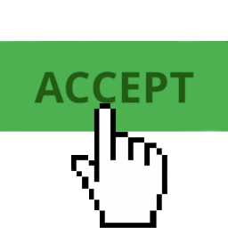
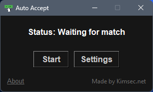
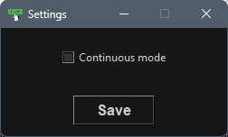
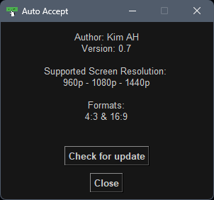

    

# 
Auto Accept For CS2

 

## Description

The Auto Accept is a lightweight application designed to automatically accept matches in Counter-Strike 2 with the mouse cursor. It features a user-friendly graphical interface and __does not require installation__, making it easy to use for anyone.

## Features
- Automatically detects and clicks the "Accept" button on the screen.
- Supports multiple screen resolutions: 960p, 1080p, 1440p (Other resolutions may work, but not tested)
- Supports both 4:3 and 16:9 screen formats.
- Continuous mode for ongoing detection and acceptance.
- Settings window to configure for your neeeds.
- About window with version information and update check.

## FAQ
### Continuous Mode

When Continuous Mode is enabled, the tool will continuously search for the "Accept" button and click it whenever it appears. This mode is useful for games where matches are frequently found.

### Non-Continuous Mode

When Continuous Mode is disabled, the tool will search for the "Accept" button and click it. After clicking the button, it will wait for 60 seconds before stopping the search. This mode is useful for games where matches are less frequent or used on low-end machine, and you want to avoid unnecessary searches.

### Start Minimized

The program vil start minimized

### Exit to tray

Makes the X (close) button minimize the program to tray, if both "Start minimized" and "Exit to tray" it will start minimized to tray. 

## Installation
1. Download the executable.
2. Run the `.exe` file directly. No installation is required.

## Usage
1. Launch the application.
2. Adjust settings as needed through the "Settings" menu.
3. The application start searching for "Accept" button on launch
4. Click the "Start" button to begin searching for Accept button if "Status: Not running". (when not Continuous mode)

### Settings

1. Click the "Settings" button to open the settings window.
2. Enable or disable Continuous Mode using the checkbox.
3. Enable or disable Start minimized
4. Enable or disable Exit to Tray
5. Click "Save" to save the settings.

### About

1. Click the "About" label to open the about window.
2. View the author, version, supported resolutions, and formats.
3. Click "Check for update" to check for the latest version.

## Screenshots

